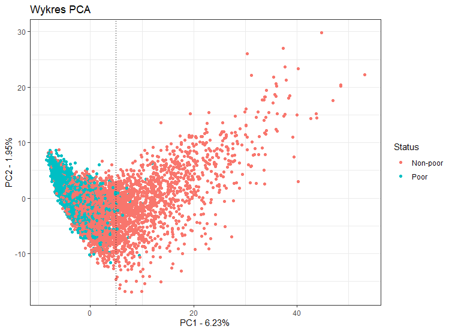
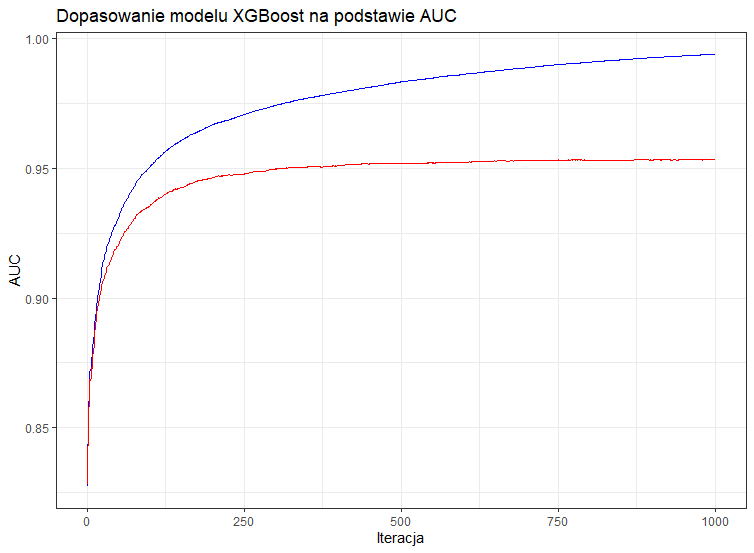
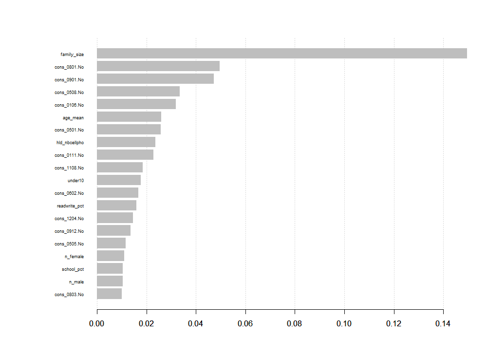

```{r setup, include=FALSE}
knitr::opts_chunk$set(echo = FALSE)
```

## Agregacja danych indywidualnych - nowe zmienne

<font size="5">

- liczność rodziny (zm. `family_size`)
- procent domowników, którzy potrafią pisać i czytać (zm. `readwrite_pct`)
- liczba osób pracujących (w ciągu 12 ostatnich miesięcy) w rodzinie (zm. `workers`)
- liczba mężczyzn w rodzinie (zm. `n_male`)
- liczba kobiet w rodzinie (zm. `n_female`)
- średnia wieku całej rodziny (zm. `age_mean`)
- procent domowników, którzy kiedykolwiek uczęszczali do szkoły (zm. `school_pct`)
- suma przepracowanych godzin całej rodziny w ciągu ostatnich 7 dni (zm. `family_weekly_wh`)
- liczba dzieci poniżej 10 roku życia (zm. `under10`)

</font>

## Wizualizacja danych wielowymiarowych - PCA

{width=650px}

## Metody klasyfikacyjne

<br>

<font size="6">

- K najbliższych sąsiadów
- Maszyna wektorów podpierających
- Lasy losowe
- XGBoost

</font>

## Algorytm k najbliższych sąsiadów


## Metoda XGBoost



## Ważność zmiennych (XGB)

{width=750px}