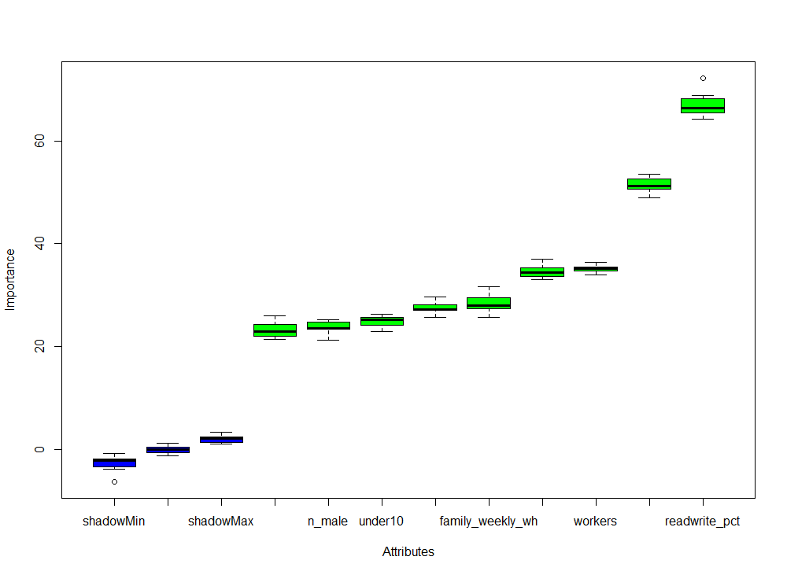
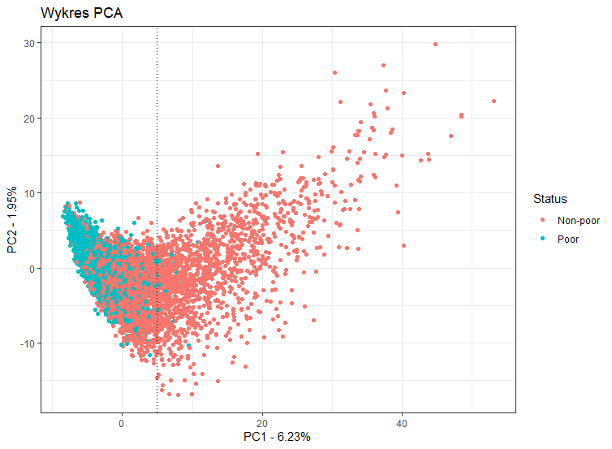
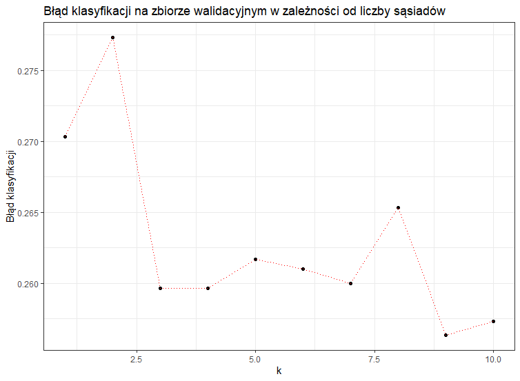
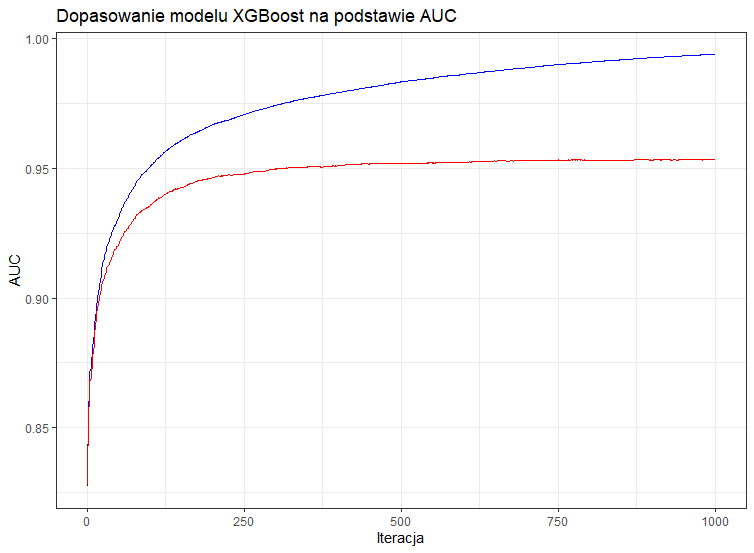
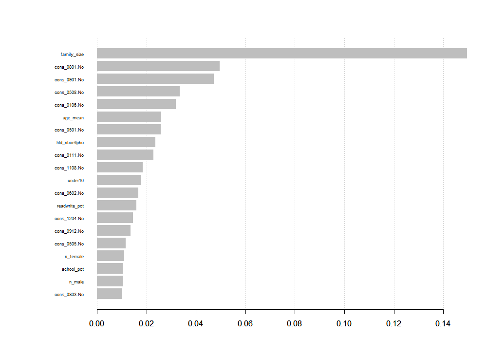

```{r setup, include=FALSE}
knitr::opts_chunk$set(echo = TRUE)
```

==================================================================================================================

## Opis wyboru i przekształceń zmiennych

Po załadowaniu bibliotek i wczytaniu danych przeszedłem do analizy danych indywidualnych. Zgrupowałem te dane po zmiennej `hid`, a następnie utworzyłem 9 nowych zmiennych:

* liczność rodziny (zm. `family_size`)
* procent domowników, którzy potrafią pisać i czytać (zm. `readwrite_pct`)
* liczba osób pracujących (w ciągu 12 ostatnich miesięcy) w rodzinie (zm. `workers`)
* liczba mężczyzn w rodzinie (zm. `n_male`)
* liczba kobiet w rodzinie (zm. `n_female`)
* średnia wieku całej rodziny (zm. `age_mean`)
* procent domowników, którzy kiedykolwiek uczęszczali do szkoły (zm. `school_pct`)
* suma przepracowanych godzin całej rodziny w ciągu ostatnich 7 dni (zm. `family_weekly_wh`)
* liczba dzieci poniżej 10 roku życia (zm. `under10`).

Następnie tworzyłem modele z wykorzystaniem samych danych indywidualnych i miały one dokładność rzędu 70%, sprawdziłem za pomocą algorytmu Boruta istotność stworzonych zmiennych i okazało się, że są istotne (wykres niżej), więc w dalszej części będę je wykorzystywał przy budowie modeli.



Po połączeniu danych indywidualnych z danymi na poziomie gospodarstwa zwizualizowałem te dane na płaszczyźnie za pomocą PCA:



Możemy zauważyć wyraźne skupisko biednych domostw.

Ostatecznie zdecydowałem się użyć wszystkich zmiennych na poziomie gospodarstwa wraz z nowymi zmiennymi z danych indywidualnych przy budowie modeli.

==================================================================================================================

## Podsumowanie eksperymentów

Zbudowałem cztery modele dopasowane na podstawie poszerzonych danych treningowych: **Random Forest**, **XGBoost**, **SVM** i **KNN**.
Testowałem je pod kątem dokładności i AUC na zbiorze walidacyjnym, pierwsze trzy zdecydowanie przewyższały pod każdym względem model KNN poza wrażliwością, czyli prawidłową klasyfikacją gospodarstw biednych, która tutaj wynosiła aż **94%**. Wynika to z tego, że biedne domostwa są mocno skupione (a przecież patrzymy na sąsiadów), co było widać na poprzednim wykresie PCA.

Zająłem się również optymalizacją parametrów. Na przykład dla metody KNN:



==================================================================================================================

## Uzasadnienie wyboru końcowej metody

Ostatecznie do predykcji dla danych testowych użyłem modelu XGBoost, który z odpowiednio dobranymi parametrami miał największą dokładność oraz wartość AUC na zbiorze walidacyjnym.

Poniższy wykres przedstawia dopasowanie tego modelu w kolejnych iteracjach:



<br>

Udało mi się osiągnąć dokładność rzędu **87%** oraz wartość AUC ponad **0.95** na zbiorze walidacyjnym.

Poniższy wykres przedstawia 20 najważniejszych zmiennych wg. tego modelu:

